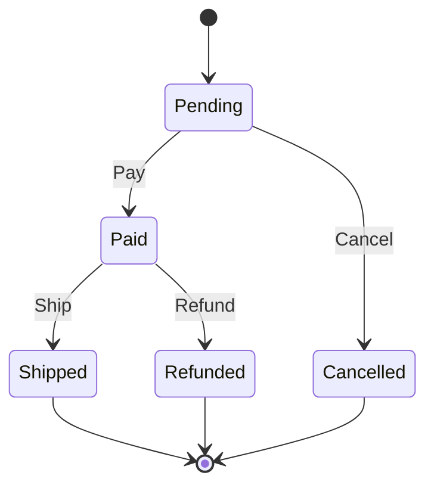

# Tyto

A Domain-Specific Language (DSL) transpiler for defining state machines and generating type-safe code in multiple target languages.

Tyto allows you to define state machine contracts in a simple, declarative syntax (`.ty` files) and automatically generates type-safe implementations. The generated code ensures compile-time safety for state transitions, making it ideal for applications where state management correctness is critical (e.g., payment processing, order management, workflow automation).

## Features

### DSL Syntax

- **State definitions** with the `state` keyword
- **Terminal states** that cannot transition further
- **State-specific data blocks** with typed fields
- **Global context** for shared data across all states
- **Event-driven transitions** with type annotations

### Transition Types

| Type | Description |
|------|-------------|
| `success` | Indicates a successful operation |
| `recoverable` | Recoverable error state |
| `fatal` | Unrecoverable error state |
| (default) | Standard transition |

### Type System

| Type | Example | Description |
|------|---------|-------------|
| `String` | `name: String` | Text value |
| `Int` | `count: Int` | Integer value |
| `Float` | `amount: Float` | Floating-point value |
| `Bool` | `active: Bool` | Boolean value |
| `Type[]` | `items: String[]` | Array of values |
| `Type?` | `tracking: String?` | Optional value |

### Code Generation Targets

| Target | Output | Description |
|--------|--------|-------------|
| **TypeScript** | `.tyto.ts` | Interfaces, union types, and a `Tyto` class with type-safe transitions |
| **Rust** | `.tyto.rs` | Structs with transition methods that consume `self` for ownership-based safety |
| **Java** | `.java` | Sealed interfaces and records with transition methods |
| **Mermaid** | `.mmd` | State diagrams for documentation |

### Validation & Analysis

Tyto performs comprehensive validation:

- **Empty machine detection** - Ensures at least one state exists
- **Deadlock detection** - Non-terminal states must have outgoing transitions
- **Terminal violation detection** - Terminal states cannot have outgoing transitions
- **Orphan state detection** - All states must be reachable from the initial state
- **Non-determinism detection** - Prevents duplicate transitions for the same event
- **Resilience checks** - States with `success` transitions must handle errors (`recoverable` or `fatal`)

## Installation

### Prerequisites

- Rust toolchain (Edition 2024)

### Build from source

```bash
git clone <repository-url>
cd tyto

# Build
cargo build --release

# Install globally (optional)
cargo install --path .
```

## Usage

### Initialize a Workspace

```bash
tyto init
```

Creates a new workspace with:
- `tyto.yaml` - Global configuration
- `tyto/example/example.yaml` - Module configuration
- `tyto/example/example.ty` - Example state machine

### Compile a Single File

```bash
tyto compile <FILE> --langs <LANGS> [--out-dir <DIR>]
```

**Options:**
- `<FILE>` - Path to the `.ty` source file
- `--langs, -l` - Target languages (comma-separated)
- `--out-dir, -o` - Output directory (default: current directory)

**Example:**
```bash
tyto compile order.ty --langs typescript,rust,mermaid --out-dir ./generated
```

### Build Workspace

```bash
# Build all modules
tyto build

# Build specific module
tyto build payments

# Use custom config
tyto build --config ./custom-tyto.yaml
```

## Configuration

### Global Configuration (`tyto.yaml`)

```yaml
workspace_dir: "./tyto"          # Directory containing modules
formatters:                       # Optional code formatters
  typescript: "npx prettier --write"
  rust: "rustfmt"
```

### Module Configuration (`<module>.yaml`)

```yaml
source: "order.ty"                # Source file name
targets:
  typescript:
    out_dir: "../../src/types"
  rust:
    out_dir: "../../src-rs"
  mermaid:
    out_dir: "../../docs"
```

## DSL Syntax

### Complete Example

```tyto
// Shared context across all states
context {
    user_id: String,
    amount: Float,
}

// Initial state
state Pending {
    on success Pay -> Paid;
    on recoverable Retry -> Pending;
    on fatal Cancel -> Cancelled;
}

// State with additional data
state Paid {
    data {
        transaction_id: String,
        paid_at: String,
    }
    on Ship -> Shipped;
    on Refund -> Refunded;
}

state Shipped {
    data {
        tracking_number: String?,
        items: String[],
    }
    terminal;
}

state Refunded {
    terminal;
}

state Cancelled {
    terminal;
}
```

### Syntax Reference

| Element | Syntax | Description |
|---------|--------|-------------|
| Comment | `// text` | Single-line comment |
| State | `state Name { ... }` | Define a state |
| Terminal | `terminal;` | Mark state as final |
| Transition | `on Event -> Target;` | Define a transition |
| Typed transition | `on success Event -> Target;` | Transition with type annotation |
| Context | `context { field: Type, ... }` | Global shared data |
| Data | `data { field: Type, ... }` | State-specific data |

## CLI Reference

| Command | Description |
|---------|-------------|
| `tyto init` | Initialize a new workspace |
| `tyto compile <FILE> -l <LANGS>` | Compile a single file |
| `tyto build [MODULE]` | Build workspace or specific module |
| `tyto --version` | Display version |
| `tyto --help` | Display help |

## Generated Code Examples

### TypeScript

```typescript
interface Pending {
  kind: "Pending";
  user_id: string;
  amount: number;
}

interface Paid {
  kind: "Paid";
  user_id: string;
  amount: number;
  transaction_id: string;
  paid_at: string;
}

type AppState = Pending | Paid | Shipped | Refunded | Cancelled;

class Tyto {
  pay(state: Pending, data: { transaction_id: string; paid_at: string }): Paid;
  // ...
}
```

### Rust

```rust
pub struct Pending {
    pub user_id: String,
    pub amount: f64,
}

impl Pending {
    pub fn pay(self, transaction_id: String, paid_at: String) -> Paid {
        Paid {
            user_id: self.user_id,
            amount: self.amount,
            transaction_id,
            paid_at,
        }
    }
}
```

### Mermaid



## License

MIT
